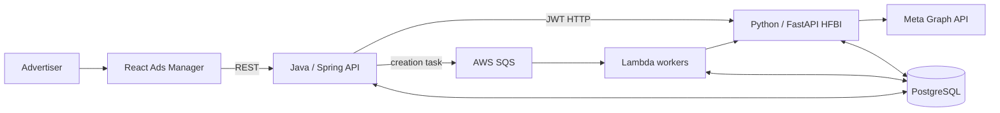

# Humanz Ads

## Current summary

Humanz Ads is a paid-campaign platform spanning a React web application, a
Java/Spring platform API, a Python/FastAPI Meta integration service (HFBI), AWS
workers and messaging, PostgreSQL, and the Meta Graph API. The provided system
materials document both interactive ad-management flows and scheduled analytics
ingestion.

The CV states that Ido worked on the platform as a Backend Developer and later
as its hands-on Backend Tech Lead. The personal ownership boundary, chronology,
scale, and outcome measurements still require Ido's confirmation.

## Business capabilities documented in the sources

- Create single or bulk ads and track their asynchronous task status.
- Edit and duplicate ads through synchronous backend-to-HFBI calls.
- Discover campaigns and synchronize ad metadata, performance insights,
  comments, video data, and monthly spend.
- Aggregate stored analytics for tables, KPI cubes, attribution views, and
  comment breakdowns in the Ads Manager UI.
- Manage partner-page relationships, campaign settings, and Meta integration
  prerequisites.

## System boundary

For component and ownership detail, see
[architecture](humanz-ads-architecture.md). For active and passive sequences,
see [data flows](humanz-ads-data-flows.md).

## Documented service responsibilities

- **Frontend:** UI state, creation/edit/duplicate workflows, analytics views,
  comments, settings, and attribution selection.
- **Java backend:** authenticated API surface, validation, orchestration, task
  creation, SQS publishing, read queries, partner pages, and campaign settings.
- **HFBI:** Meta API integration, ad operations, analytics ingestion, metadata,
  comments, and currency handling.
- **Lambda workers:** scheduled synchronization and asynchronous creation-task
  execution.
- **Shared infrastructure:** PostgreSQL, SQS, SNS, S3, credentials, and external
  Meta endpoints.

These are system-level boundaries documented in the source set, not statements
about which parts Ido personally implemented.

## CV-derived personal responsibility

The CV attributes the following to Ido, currently with `recalled` status:

- Backend architecture and technical roadmap.
- Meta Ads and external API integrations.
- Campaign execution, attribution, and data synchronization.
- Event-driven analytics and financial reporting.
- Notification, automation, monitoring, and operational tooling.
- Production support and investigation.

## Important architecture characteristics

- Ad creation is asynchronous: the API creates a task, publishes its ID to SQS,
  and returns a task identifier while a Lambda performs Meta-side work.
- Edit and copy operations use a synchronous backend-to-HFBI path.
- Analytics are read from PostgreSQL rather than fetched from Meta in the user
  request path.
- Scheduled workers populate campaign, metadata, insights, comment, and spend
  data through HFBI.
- Multiple services share database tables, so ownership and concurrent-write
  behavior are important design topics.
- The integration layer centralizes Meta operations through one client module.

## Reconstruction status

- Business context: partial
- Chronology: unknown
- Personal ownership boundaries: unknown
- Architecture: documented, personal validation pending
- Request and data flows: documented, personal validation pending
- Scale and SLOs: unknown
- Decisions and alternatives: partial analysis, historical rationale unknown
- Failure modes and incidents: potential risks documented; actual incidents unknown
- Interview-ready explanations: outline created, personal evidence pending

## Claim ledger

| Claim | Status | Evidence | Confirmation needed |
|---|---|---|---|
| The system uses React, Java/Spring, Python/FastAPI, PostgreSQL, AWS messaging/workers, and Meta Graph API | verified | Provided system document and architecture diagrams | Validate that this represents the relevant production period |
| Ad creation uses a DB task, SQS, Lambda, HFBI, Meta, and frontend polling | verified | Active-process L2/L3 diagrams and DOCX ad-creation flow | Confirm retries, idempotency, and exact status lifecycle |
| Analytics are synchronized asynchronously and served from PostgreSQL | verified | Passive-process and data-flow diagrams | Confirm schedules, freshness expectations, and production scale |
| Ido architected and built Humanz Ads from scratch | recalled | Current CV | Define pre-existing components, phases, team, and direct ownership |
| Ad creation decreased from 15 minutes to 20 seconds | recalled | Current CV | Baseline, measurement method, and workflow boundaries |
| Approvals decreased from 2 days to 3 seconds | recalled | Current CV | Define approval and how the result was measured |
| Work contributed to 30% Q1 and 100%+ overall revenue growth | recalled | Current CV | Period, attribution logic, and source of figures |
| Shared-table writes and HTTP coupling created operational risk | inferred | Risk analysis in the provided DOCX | Whether these caused actual incidents or were only review findings |

## Highest-priority open questions

1. What existed when Ido joined, and what was added or redesigned in each role?
2. Which services, flows, tables, and operational responsibilities did Ido own
   directly versus co-design or inherit?
3. What were the task states, retry rules, idempotency strategy, and failure
   recovery behavior of ad creation?
4. What were the request volume, campaign/ad volume, sync frequency, latency,
   availability, and data-freshness requirements?
5. Which design decisions had real alternatives, and why were SQS, Lambda,
   polling, shared PostgreSQL, and the HFBI boundary chosen?
6. Which production incident best demonstrates diagnosis, ownership, and a
   lasting system improvement?
7. How were the CV outcome metrics measured and attributed?

## Interview derivative

Use the [Humanz Ads project interview brief](../../domains/interviews/projects/humanz-ads.md)
for the reconstruction sequence and interviewer question bank.

## Sources

- [Current CV](../../raw/resume/2026-08-22-ido-lev-cv.pdf)
- [Authorized source-set notes](../../raw/project-materials/humanz-ads/2026-08-22/README.md)
- [System mapping DOCX](../../raw/project-materials/humanz-ads/2026-08-22/ads-system.docx)
- [Architecture overview L1](../../raw/project-materials/humanz-ads/2026-08-22/architecture-diagrams/01-architecture-overview-l1.mmd)
- [Architecture overview L2](../../raw/project-materials/humanz-ads/2026-08-22/architecture-diagrams/02-architecture-overview-l2.mmd)
- [Architecture overview L3](../../raw/project-materials/humanz-ads/2026-08-22/architecture-diagrams/03-architecture-overview-l3.mmd)
