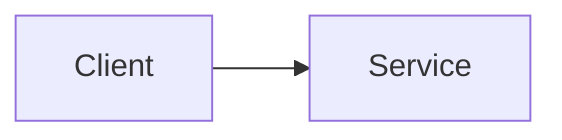

# {{title}}

## Executive summary

## Business problem

## My responsibility

Separate direct ownership, collaboration, and team-level outcomes.

## Architecture

## Request and data flow

## Scale and constraints

Do not add metrics without a source or an explicit `recalled` status.

## Important decisions and trade-offs

## Alternatives considered

## Failures, incidents, and lessons

## What I would change today

## Claim ledger

| Claim | Status | Evidence | Notes |
|---|---|---|---|
|  | unknown |  |  |

## Open questions

## Interview derivatives

Link interview-specific artifacts from `domains/interviews/projects/`.

