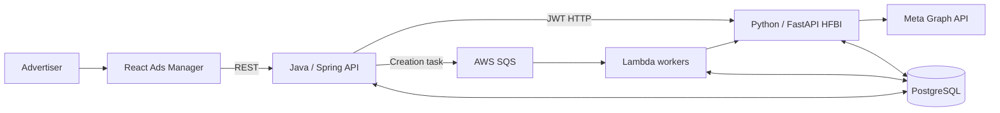

# Humanz Ads

## תקציר

Humanz Ads היא פלטפורמה לניהול והפעלת קמפיינים ממומנים. החומרים מתארים מערכת
המשלבת אפליקציית React, API ב־Java/Spring, שכבת אינטגרציה עם Meta ב־Python/
FastAPI בשם HFBI, תהליכי Lambda, תורים והודעות ב־AWS, PostgreSQL ו־Meta Graph
API. `[Source: raw/work/backend-interviews/humanz-ads/2026-08-22/ads-system.docx, Architecture Overview]`

עידו אישר שהפרויקט היה greenfield: הוא וה־CTO בנו את התשתית מאפס, ועידו היה
אחראי על תכנון הארכיטקטורה ועל כתיבת הקוד. האחריות הייתה משותפת עם ה־CTO;
החלוקה ברמת רכיב בודד עדיין אינה מתועדת.
`[Source: raw/work/backend-interviews/humanz-ads/2026-08-22/reconstruction-session-01.md, User statement and Faithful interpretation]`

## הבעיה העסקית והיכולות

המערכת נועדה לאפשר יצירה, ניהול ומדידה של מודעות וקמפיינים מתוך Humanz, במקום
להסתמך רק על עבודה ידנית מול Meta. המקורות מתעדים את היכולות הבאות:

- יצירת מודעה בודדת או bulk באמצעות task אסינכרוני.
- עריכה ושכפול של מודעות.
- גילוי קמפיינים וסנכרון metadata, insights, תגובות והוצאה חודשית.
- הצגת נתוני ביצועים, attribution וניתוח תגובות בממשק Ads Manager.
- ניהול קשרי partner pages והגדרות ברמת קמפיין.

`[Source: raw/work/backend-interviews/humanz-ads/2026-08-22/ads-system.docx, Backend Endpoints, HFBI Endpoints, and Data Flows]`

## גבול המערכת

התרשים הוא סינתזה של תרשימי L1-L3 שסופקו, ולא צילום של deployment topology
מלא. `[Source: raw/work/backend-interviews/humanz-ads/2026-08-22/architecture-diagrams/01-architecture-overview-l1.mmd, lines 1-18]`

## אחריות מתועדת ברמת שירות

- **Frontend:** workflow של יצירה, עריכה ושכפול; טבלאות, KPI, תגובות והגדרות.
- **Java backend:** API מאומת, validation, orchestration, יצירת task, שליחה
  ל־SQS ושאילתות analytics.
- **HFBI:** אינטגרציית Meta, פעולות על מודעות, ingest של נתונים, metadata,
  comments והמרות מטבע.
- **Lambda workers:** ביצוע יצירה אסינכרונית וסנכרונים מתוזמנים.
- **PostgreSQL ותשתיות AWS:** state משותף, messaging, media וסטטוס תהליכים.

`[Source: raw/work/backend-interviews/humanz-ads/2026-08-22/architecture-diagrams/17-service-ownership-l2.mmd, lines 1-44]`

זוהי חלוקת אחריות בין שירותים, לא הוכחה לחלוקת העבודה האנושית. הבעלות האישית
המאומתת כרגע היא אחריותו של עידו לתכנון הארכיטקטורה ולבניית הקוד בשיתוף ה־CTO.

## מצב הידע

- נקודת התחלה greenfield: מאומתת על ידי עידו.
- ארכיטקטורת המערכת ו־happy paths: מתועדים במקורות.
- אחריות אישית ברמת הפרויקט: מאומתת.
- סדר הבנייה והחלוקה ברמת רכיבים: חסרים.
- scale, SLOs ועלויות: חסרים.
- guarantees של queue ו־workflow: חסרים חלקית.
- incidents אמיתיים: חסרים.
- מדדי CV ותוצאות עסקיות: קיימים בקורות החיים אך עדיין דורשים הסבר מדידה.

## טענות מרכזיות ורמת ביטחון

| טענה | מצב | מקור או מגבלה |
|---|---|---|
| המערכת נבנתה מאפס | אושר על ידי עידו | `[Source: raw/work/backend-interviews/humanz-ads/2026-08-22/reconstruction-session-01.md, User statement]` |
| עידו היה אחראי על תכנון הארכיטקטורה והקוד יחד עם ה־CTO | אושר על ידי עידו | `[Source: raw/work/backend-interviews/humanz-ads/2026-08-22/reconstruction-session-01.md, User statement]` |
| יצירת מודעה עוברת דרך DB task, SQS, Lambda, HFBI ו־Meta | מתועד | `[Source: raw/work/backend-interviews/humanz-ads/2026-08-22/architecture-diagrams/09-active-process-l3.mmd, lines 13-55]` |
| analytics מסונכרנים אסינכרונית ונקראים מ־PostgreSQL | מתועד | `[Source: raw/work/backend-interviews/humanz-ads/2026-08-22/architecture-diagrams/06-passive-process-l3.mmd, lines 1-52]` |
| יצירת מודעה ירדה מ־15 דקות ל־20 שניות | טענת CV | חסרה שיטת מדידה ותחום workflow |
| approvals ירדו מיומיים לשלוש שניות | טענת CV | חסרה הגדרה של approval ומדידה |
| העבודה תרמה ל־30% ברבעון ול־100%+ צמיחה כוללת | טענת CV | חסרים תקופה, מקור וייחוס סיבתי |

## דפים קשורים

- [[humanz-ads-architecture]]
- [[humanz-ads-data-flows]]
- [[humanz-ads-risks-and-decisions]]
- [[humanz-ads-interview-practice]]
- [[candidate-profile]]
